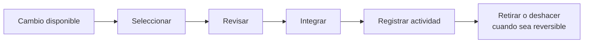
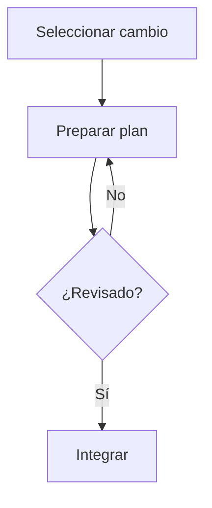
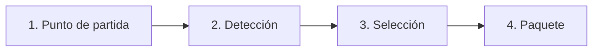
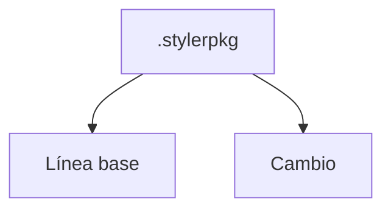

# Styler

> **Convierte cambios hechos en Linux en paquetes que puedes revisar, reproducir, compartir y retirar.**

Styler busca que una personalización de Linux deje de ser una colección de pasos difíciles de recordar.
Los cambios se presentan en una sola interfaz, se revisan antes de integrarlos y pueden conservarse como paquetes `.stylerpkg`.

<!--
CAPTURA PRINCIPAL
Guarda una captura como: docs/images/styler-overview.png
y descomenta este bloque:

<p align="center">
  
</p>
-->

---

## ¿Qué puedes hacer con Styler?

| | |
|---|---|
| **Cambios** | Ver, seleccionar, integrar y retirar cambios disponibles. |
| **Actividad** | Consultar operaciones aplicadas y deshacer las que sean reversibles. |
| **Herramientas** | Abrir el **Constructor de cambios** para detectar y empaquetar personalizaciones. |
| **`.stylerpkg`** | Importar, inspeccionar, exportar o eliminar paquetes portables de Styler. |

No necesitas conocer la estructura interna de un DAG para usar la interfaz principal.
La parte técnica sigue disponible más abajo para quien quiera profundizar.

---

## Cómo funciona



Styler mantiene **un solo flujo de aplicación**.

Importar o crear un `.stylerpkg` de tipo `change` **no ejecuta el cambio inmediatamente**.
El cambio se registra en el catálogo y aparece en **Cambios**, donde se revisa y se integra igual que los cambios incorporados.

`Paquetes guardados` se usa para administrar el artefacto: **importar, inspeccionar, exportar o eliminar**. La aplicación del cambio ocurre desde **Cambios**.

---

# Primeros pasos

## 1. Ejecutar Styler

Desde el proyecto:

```bash
scripts/local/run-styler.sh
```

O, después de instalarlo:

```bash
styler
```

También puedes comprobar la versión y el estado básico de la instalación:

```bash
styler --version
styler doctor
```

<details>
<summary><strong>▶ Ver instalación mediante el script del proyecto</strong></summary>

<br>

El instalador del proyecto puede ejecutarse con:

```bash
bash scripts/local/install.sh
```

Después de instalar, el comando principal es:

```bash
styler
```

El instalador publica el comando sin depender de Conda y administra la ubicación del ejecutable según el entorno disponible.

</details>

---

## 2. Elegir un cambio

Entra en **Cambios** y haz clic sobre cualquier parte de la fila del cambio que quieras integrar.

En Styler ya no hace falta acertar sobre una casilla pequeña: **la fila completa funciona como selector**.

- Si seleccionas **un cambio**, el botón inferior mantiene el flujo individual.
- Si seleccionas **varios cambios**, el mismo botón cambia a **`Integrar lote (N)`**.

<!--
CAPTURA SUGERIDA
docs/images/change-selection.png

<p align="center">
  
</p>
-->

<details>
<summary><strong>▶ Ejemplo: integrar un solo cambio</strong></summary>

<br>

Supongamos que **PhotoGIMP** aparece entre los cambios disponibles.

1. Abre **Cambios**.
2. Haz clic sobre la fila de **PhotoGIMP**.
3. Styler deja ese cambio seleccionado.
4. Usa el botón inferior para continuar con la integración individual.
5. Revisa el plan antes de ejecutarlo.

El cambio utiliza el mismo flujo de revisión e integración que los paquetes importados.

</details>

<details>
<summary><strong>▶ Ejemplo: integrar varios cambios como lote</strong></summary>

<br>

Si tienes varios cambios disponibles:

1. Selecciona el primero haciendo clic sobre su fila.
2. Selecciona uno o más cambios adicionales.
3. El botón inferior cambia automáticamente a:

```text
Integrar lote (N)
```

4. Revisa el conjunto antes de comenzar.
5. Styler ejecuta los cambios de manera secuencial.

Antes de ejecutar cada cambio, Styler reconstruye su plan con el estado actualizado del sistema.
Si uno falla, el lote se detiene antes de iniciar los siguientes y la pantalla final distingue lo completado, lo fallido y lo pendiente.

</details>

---

## 3. Revisar antes de integrar

La idea es que **seleccionar no signifique ejecutar inmediatamente**.



Los cambios importados desde `.stylerpkg` pasan por el mismo flujo de revisión que los cambios incorporados.

Cuando una operación necesita permisos administrativos, Styler solicita autorización **antes de iniciar el DAG**.

---

# Constructor de cambios

El **Constructor** sirve para convertir cambios detectados en tu sistema en un paquete portable de Styler.

El asistente tiene cuatro etapas:



### 1. Punto de partida

Elegir, importar o capturar la **línea base** que se utilizará como referencia.

### 2. Detección

Escanear aplicaciones, AppImages y recursos visuales.

### 3. Selección

Elegir únicamente los elementos que quieres incluir en el paquete.

### 4. Paquete

Generar el plan, revisar su desglose cuando sea necesario y crear el `.stylerpkg`.

Las acciones menos frecuentes están agrupadas bajo **Más**.
El informe del plan distingue lo incluido de lo omitido y explica el motivo.

<!--
CAPTURA SUGERIDA
docs/images/constructor.png

<p align="center">
  
</p>
-->

<details>
<summary><strong>▶ Ejemplo: crear un paquete a partir de cambios detectados</strong></summary>

<br>

Un flujo típico es:

1. Seleccionar una línea base.
2. Ejecutar la detección.
3. Revisar las aplicaciones, AppImages o recursos encontrados.
4. Mover a la selección solamente aquello que quieres conservar.
5. Generar el plan.
6. Crear el paquete.

El resultado portable utiliza la extensión:

```text
.stylerpkg
```

Al terminar el paquete, el Constructor conserva la línea base, limpia la selección y vuelve a **Detección**.

Los estados ya empaquetados dejan de ofrecerse mientras sigan idénticos. Si una aplicación se actualiza, un archivo cambia o se elimina el paquete local que los representaba, pueden volver a aparecer como pendientes.

</details>

---

# ¿Qué es un `.stylerpkg`?

`.stylerpkg` es el **único formato portable de Styler**.

Puede representar:

- una **línea base**, o
- un **cambio**.

Las recetas YAML, grafos, acciones y recursos que pueda contener son detalles internos del paquete; no son formatos públicos independientes que el usuario tenga que administrar por separado.



<details>
<summary><strong>▶ ¿Qué ocurre al importar un paquete de cambio?</strong></summary>

<br>

Importarlo **no aplica automáticamente la modificación**.

Styler registra sus DAG en el catálogo y el cambio aparece en **Cambios**.
Desde allí se selecciona, se revisa y se integra mediante el flujo normal.

</details>

---

# Líneas base

Una línea base sirve como punto de referencia para detectar qué cambió.

Las líneas base oficiales precargadas son **defaults por identidad de sistema**, no un default global para cualquier instalación.

La baseline oficial incluida actualmente pertenece a:

```text
Linux Mint 22.3
XFCE
X11
stable
x86_64
```

Solo se recomienda y adopta automáticamente cuando esa identidad coincide.
Otra distribución, versión, escritorio, sesión, modelo de release o arquitectura necesita su propia baseline oficial.

<details>
<summary><strong>▶ Preparar una línea base para el catálogo oficial</strong></summary>

<br>

En **Punto de partida**:

- **Exportar seleccionada** conserva el tipo actual de la línea base.
- **Preparar para catálogo oficial** crea una copia oficial sin modificar la personalizada local.
- Para hacerlo, Styler exige confirmar que la captura procede de una instalación limpia.

El `.stylerpkg` resultante puede colocarse en:

```text
styler/baselines/catalog/
```

El catálogo oficial acepta únicamente paquetes `.stylerpkg` de tipo `baseline`.

</details>

---

# Actividad y recuperación

**Actividad** muestra las operaciones aplicadas y permite deshacer aquellas que sean reversibles.

Styler también conserva información de diagnóstico cuando una integración falla, en lugar de reducir el problema a un simple código genérico.

Styler refuerza además la protección del registro de cambios:

- Si `change-records.json` no puede escribirse, el DAG no arranca.
- Si el sistema de archivos se vuelve de solo lectura durante una ejecución, Styler distingue el fallo de persistencia del resultado real del DAG.
- Los lotes se detienen.
- Se guarda un diagnóstico de emergencia fuera de la biblioteca.

<!--
CAPTURA SUGERIDA
docs/images/activity.png

<p align="center">
  
</p>
-->

---

# Ejemplos incluidos

## PhotoGIMP

PhotoGIMP aparece como un cambio incorporado y utiliza el mismo flujo de **Cambios** que un paquete importado.

<details>
<summary><strong>▶ Nota técnica sobre operaciones largas de PhotoGIMP</strong></summary>

<br>

Las operaciones largas ya no dependen de timeouts totales rígidos.

Mientras `apt` o `flatpak` continúen produciendo salida, Styler renueva la espera.
La inicialización de GIMP tampoco depende del antiguo límite exterior fijo de 150 segundos: la espera puede continuar mientras el árbol de archivos siga cambiando, con un techo amplio de seguridad para evitar bloqueos infinitos.

</details>

## Affinity

Affinity declara **AppImageLauncher** como requisito.

Antes de descargar AppImageLauncher, Styler comprueba la capacidad `ail-cli`. Si ya existe, puede reutilizar ese proveedor sin reinstalarlo.

<details>
<summary><strong>▶ Ver cómo se integra Affinity</strong></summary>

<br>

Styler compone el cambio de Affinity y su requisito en un solo DAG:

1. Instala o reutiliza AppImageLauncher.
2. Descarga el AppImage oficial de Affinity.
3. Lo integra mediante `ail-cli`.
4. Verifica la entrada de escritorio.

Los assets están fijados por tag, nombre y SHA-256.

La definición incluida actualmente se ofrece solo para:

```text
Familias APT: Ubuntu / Debian / Linux Mint
Arquitectura: x86_64
```

Esto se debe a que el proveedor incorporado utiliza el `.deb` amd64 de AppImageLauncher y el AppImage x86_64 de Affinity.

</details>

---

# CLI

La interfaz principal puede iniciarse con:

```bash
styler
```

Comandos disponibles para explorar funciones específicas:

```bash
styler change --help
styler constructor --help
styler baseline --help
styler package --help
```

---

# Para desarrolladores

La mayoría de usuarios no necesita esta sección.

<details>
<summary><strong>▶ Ejecutar las pruebas</strong></summary>

<br>

```bash
python -m pytest
```

</details>

<details>
<summary><strong>▶ Construir el wheel</strong></summary>

<br>

```bash
python -m build --wheel --no-isolation
```

</details>

<details>
<summary><strong>▶ PATH de instalación</strong></summary>

<br>

El instalador añade automáticamente:

```text
${XDG_BIN_HOME:-$HOME/.local/bin}
```

al `PATH` del proceso de instalación y lo deja persistido en `~/.profile` y en el archivo del shell interactivo compatible, como `~/.bashrc` o `~/.zshrc`.

No es necesario añadir manualmente una ruta específica para un nombre de usuario.

Si `scripts/local/install-styler.sh` se ejecuta con `source`, también actualiza inmediatamente el `PATH` del shell actual.

</details>

---

# Cambios recientes

El README prioriza ahora el uso del programa. Los detalles técnicos quedan plegados para no interrumpir la explicación principal.

<details>
<summary><strong>▶ Runtime de ejecución</strong></summary>

<br>

- PipeCraft pasa a ser el runtime de producción preferido mediante IPC local.
- Styler compila su `ExecutionPlan` a un pipeline transitorio de PipeCraft; el DAG, recursos, concurrencia, cancelación, eventos y persistencia pertenecen al motor Rust.
- Los executors Linux de Styler se ejecutan como plugins externos `pipecraft.plugin/v1`; PipeCraft sigue sin conocer APT, Flatpak, receipts ni `.stylerpkg`.
- PipeCraft sigue siendo un proyecto Rust separado y Styler no vendoriza su source, pero la distribución oficial incluye un binario PipeCraft privado por arquitectura. `PIPECRAFT_BIN`, `PATH` y `PIPECRAFT_SOURCE_DIR` quedan sólo como rutas de desarrollo/override.
- Si PipeCraft no está disponible, las operaciones productivas con efectos fallan cerrado. El backend Python anterior sólo puede activarse de forma explícita para tests/compatibilidad; no existe fallback mutador silencioso.
- `styler doctor` muestra el estado del binario y del servicio PipeCraft.
- El servicio usa un workspace privado en `.styler/pipecraft/` y arranca bajo demanda.

</details>

<details>
<summary><strong>▶ Selección y actividad</strong></summary>

<br>

- La fila completa de **Cambios** funciona como selector.
- Un solo botón inferior decide entre integración individual y `Integrar lote (N)`.
- Se elimina la casilla pequeña y el segundo botón específico para lotes.
- Se protege `change-records.json` frente a fallos de almacenamiento.
- Un fallo de persistencia puede distinguirse del resultado real del DAG.
- Los lotes se detienen ante ese tipo de problema y Styler conserva un diagnóstico de emergencia.

</details>
